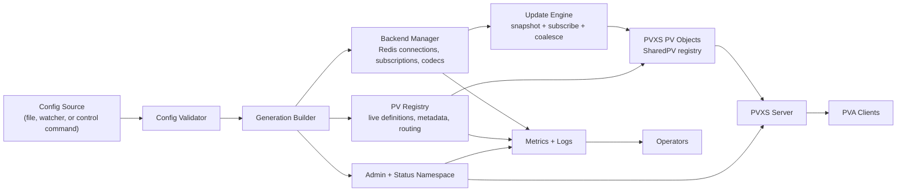

# Redis PVXS IOC Design

Status: Proposal
Date: 2026-04-20
Audience: Controls software team
Working name: `redis-pvxs-ioc`

## Executive Summary

We should build a new standalone PVXS product for serving Redis-backed PVs, rather than continue either `general-epics-ioc` or `genioc2` as-is.

The core decision is simple:

- Prioritize zero process downtime for config and backend changes.
- Prioritize high-performance PVXS serving over classic IOC database semantics.
- Treat EPICS database/QSRV compatibility as an optional integration layer, not as the core architecture.
- Keep ACF and access-security behavior as a first-class product requirement.

This product should look like an IOC to operators and clients, but internally it should be a standalone PVXS daemon with a hot-reloadable PV registry, a typed Redis backend, and a transactional config apply engine.

## Why A New Product

Both current prototypes prove something useful, but neither is the right core for a production system.

### `general-epics-ioc`

What it proves:

- Direct PVXS serving of Redis-backed PVs works.
- A schema-driven PV model is much closer to the real problem than hand-written record files.
- Split get/put/readback semantics are the right abstraction.

Why it should not become the product unchanged:

- It is still effectively startup-configured, not built around live reconfiguration.
- It mixes product logic, config parsing, and PV lifecycle too tightly.
- It uses a per-PV construction model, but not a generation-based config apply model.
- It is not structured like a standalone operational product yet.

### `genioc2`

What it proves:

- Reusing standard EPICS database support is easy to understand.
- `pvxsIoc` and normal database loading are a comfortable bridge from existing EPICS practice.

Why it should not become the product core:

- It depends on `.db` loading before `iocInit()`, which blocks true structural hot reload.
- It is currently narrow in scope, with only early device support coverage.
- It couples Redis behavior to record lifecycle instead of making Redis the primary runtime model.
- It pays the complexity cost of classic record processing without getting the main benefit we care about: never taking the process down.

## Product Thesis

The product should be:

- A standalone PVXS server process.
- Config-driven and hot-reloadable.
- Redis-backed first.
- Built around dynamic PV lifecycle and high monitor throughput.
- Capable of serving thousands of PVs with stable latency.
- Able to change configuration and backend bindings without restarting the process.

In short:

> Build a PVXS appliance, not a soft IOC with Redis glued onto the side.

## Goals

- No process restart for config changes.
- No process restart for backend connection or routing changes.
- High monitor throughput and low update latency.
- Clean support for typed scalars and arrays.
- Clean support for separate setpoint and readback channels.
- Explicit alarm, timestamp, and metadata handling.
- Transactional config apply with rollback on failure.
- Operationally simple deployment.
- Strong observability and failure reporting.
- Native support for ACF-based read/write policy enforcement.
- Alignment with newer EPICS access-security behavior for forward-compatible ACF parsing, HAG DNS refresh, and long-lived client permission updates.

Availability scope for v1:

- This no-restart promise applies to config and backend changes only.
- It does not yet imply zero-downtime binary upgrades.
- It does not yet imply host-failure tolerance or HA failover.

## Non-Goals For MVP

- Full classic record-processing compatibility.
- CA-first behavior.
- IOC database links, forward links, or record scanning semantics.
- Reproducing the entire EPICS record zoo.
- Arbitrary script execution in the server.
- Multi-backend support before the Redis backend is solid.
- Full database-channel-based trap-write integration in the first cut.
- Full ACF feature parity on day one.

## Product Positioning

This should be presented internally as:

"A production-grade Redis-to-PVXS serving layer that can replace custom glue IOCs for dynamic data namespaces."

That pitch matters because it is narrower and stronger than "generic next-generation IOC." It gives the team a clear first market:

- Redis-backed systems
- dynamic or large PV namespaces
- services that cannot afford process restarts for routine config churn

## Architecture Overview



## Core Architectural Decisions

### 1. Standalone PVXS server first

The core process should use `pvxs::server::Server` directly, not `pvxsIoc` and not the EPICS database, for the main data plane.

Reason:

- The product needs dynamic add/remove/rebind of PVs at runtime.
- The server is the product.
- We do not need record processing in the hot path.

### 2. SharedPV registry first, custom Source later if needed

The initial implementation should use a managed registry of `SharedPV` instances added to the server dynamically.

Reason:

- It is simpler to build and reason about.
- It fits a config-defined PV namespace.
- It still allows live add/remove/update semantics.

We should keep the internal interfaces clean enough that we can later swap the registry to a custom `Source` if large namespace scale or search behavior demands it.

### 3. Generational config apply

Every config load produces a new immutable generation.

A generation contains:

- parsed and validated PV definitions
- compiled type codecs
- backend connection plan
- subscription plan
- metadata and alarm rules

Config apply should follow this sequence:

1. Parse and validate the new config.
2. Build the new generation off to the side.
3. Open backend connections and subscriptions for the new generation.
4. Prime initial values and verify required routes.
5. Atomically swap affected PVs into service.
6. Drain and retire the old generation.

This is the key design choice that makes "never take it down" believable.

### 4. Redis is the first-class runtime model

Redis should not be hidden behind record support.

The server should have a clear backend abstraction:

- snapshot read
- subscribe to updates
- write setpoint
- optional write confirmation
- backend health and reconnect state

Redis is the first implementation of that abstraction.

### 5. Reserved admin namespace

The server should expose its own operational PVs under a reserved namespace, for example:

- `SYS:<instance>:config:version`
- `SYS:<instance>:config:apply`
- `SYS:<instance>:config:last_error`
- `SYS:<instance>:backend:state`
- `SYS:<instance>:stats:pv_count`
- `SYS:<instance>:stats:update_rate`

This keeps the product observable without needing an IOC shell.

### 6. ACF support is product functionality, not a compatibility extra

The standalone product should enforce ACF files directly.

Reason:

- Teams already have ACF operational knowledge and existing policy files.
- PVXS clients still need stable read/write authorization semantics.
- Your local `epics-base` and `pvxs` work is moving the ACF story forward in ways the new product should inherit, not bypass.

This means the standalone server should use the EPICS access security library as its policy engine rather than inventing a new policy format.

## PV Model

Each PV definition should be explicit and typed.

Suggested schema:

```yaml
namespace: DEMO
instance: redis-pvxs-01

pvs:
  - name: magnet:current
    type: float64
    shape: scalar
    read:
      backend: redis
      key: magnets:1:current:rb
    write:
      backend: redis
      key: magnets:1:current:sp
    confirm:
      backend: redis
      key: magnets:1:current:rb
      timeout_ms: 250
    metadata:
      units: A
      display_precision: 3
      description: Magnet current
    alarm:
      high: 10.0
      low: 0.0
      hysteresis: 0.1
```

Core fields should include:

- PV name
- scalar vs array shape
- element type
- read route
- optional write route
- optional confirmation route
- metadata
- alarm policy
- access policy

## Hot Reload Semantics

The product promise must be precise.

What "never take it down" should mean:

- The process does not restart for config changes.
- Unaffected PVs stay live while config is applied.
- Additive changes appear online without downtime.
- Backend routing changes are applied without taking the process down.
- Failed config applies do not poison the running generation.

What it should not pretend to mean:

- Incompatible changes to an individual PV type or shape will not always preserve existing client channels.
- Binary upgrades happen without restarts.
- Host failure is transparent to clients.

For example:

- If units or alarm limits change, update in place.
- If read/write backend keys change, rebind in place if the PV type is unchanged.
- If a PV changes from scalar to array, or `float64` to `string`, replace that PV object and let affected clients reconnect to the new definition.

That is still a valid no-process-downtime story.

## Redis Backend Design

The Redis backend should provide:

- connection management
- reconnect with backoff
- separate read and write paths
- snapshot plus streaming updates
- write confirmation support
- typed decode and encode
- update ordering and dedupe

### Data Flow

For each PV:

1. Fetch last known value from Redis.
2. Build the PV object with the correct type and metadata.
3. Subscribe to update events.
4. Publish only monotonic updates.
5. On put, write to the configured route.
6. If confirmation is configured, wait for readback or version acknowledgement.

### Redis-Specific Principles

- Avoid polling in the steady state.
- Prefer explicit producer writes plus explicit subscriptions.
- Keep connection count bounded and shared across PVs.
- Precompile codecs at config load time.
- Treat arrays as binary payloads or typed buffers where practical, not as per-element conversions in the hot path.

## Performance Model

Performance is a design goal, not a later cleanup item.

### Fast path rules

- No YAML parsing after generation build.
- No per-update dynamic type discovery.
- No record processing or `dbProcess()` in the data plane.
- No global reload lock that blocks all PV updates.
- No unnecessary value copies for arrays.

### Runtime structure

- One immutable config generation plus one active runtime generation.
- Sharded update executors or event loops for backend callbacks.
- Per-PV state kept minimal and cache-friendly.
- Coalesce backend bursts before posting to monitors when needed.
- Bound queue sizes and expose dropped/coalesced counters.

### Expected scaling target for MVP

The first production target should be framed as:

- thousands of PVs
- mixed scalar and array traffic
- sustained backend update rates without process instability
- config apply times short enough to treat reload as routine operations work

We should benchmark against the workloads we actually expect, not generic synthetic IOC numbers.

## Reliability Model

The runtime should assume that configuration, networks, and backends will fail in normal operation.

### Requirements

- Last good generation remains active until replacement is proven ready.
- Partial backend failure only degrades affected PVs.
- Per-PV invalid or disconnected state is visible to clients.
- Config validation failures never damage the active runtime.
- Old generations are retired only after their replacements are live.

### Error handling

- Backend disconnected: keep PV online, raise alarm/state metadata, and optionally serve last value as stale.
- Decode failure: mark affected PV invalid and log a structured error.
- Write timeout: return put error to the client and expose a counter.
- Bad config: reject apply and keep current generation.

## Operational Model

The product needs to be operable like infrastructure, not like a lab-only executable.

### Required operational features

- structured logs
- metrics export
- reserved admin PV namespace
- config apply history
- current generation identifier
- per-backend and per-PV health counters
- dry-run config validation mode
- clean startup and clean draining shutdown

### Config sources

Support order:

1. local config file
2. file watcher or explicit reload command
3. later: remote config service if needed

The important part is transactional apply, not where the bytes came from.

## Security And Access Policy

ACF support should be a first-class requirement.

### Design stance

- Use EPICS access security parsing and evaluation directly.
- Keep the product standalone, but do not hand-roll access semantics.
- Make ACF loading and reloading part of normal product operation.
- Explicitly target an MVP subset first, not full historical ACF coverage.

### Recommended implementation

Use the `epics-base` access security library directly in the standalone runtime:

- load ACF text with `asInitFile()` or `asInitMem()`
- assign each served PV to an ASG
- create an `ASMEMBERPVT` per served PV or policy-bearing entity
- create an `ASCLIENTPVT` per connected client credential set
- evaluate reads with `asCheckGet()`
- evaluate writes with `asCheckPut()`
- register change-of-access callbacks so long-lived channels react to policy changes

This is important because it gives the standalone product ACF-aligned policy behavior without dragging the IOC database into the hot path.

### Required ACF behavior

The product should explicitly target the newer behavior already present in your local branches and dependency tree:

- forward-compatible ACF parsing, so newer grammar elements do not break older deployments when syntactically valid
- `HAG()` hostname support with DNS refresh by TTL when `asCheckClientIP=1`
- permission recomputation for long-lived clients when HAG DNS state changes
- PVXS write-permit behavior that allows an operation if any acceptable credential grants access
- support for `role/...` style `UAG()` matching where available in the dependency stack

### MVP ACF subset

The first release should explicitly support:

- `ASG(...)`
- `RULE(..., READ|WRITE [, TRAPWRITE|NOTRAPWRITE])`
- `UAG(...)`
- `HAG(...)`
- host/IP checks and refreshed HAG DNS evaluation
- long-lived client permission recomputation

The first release should explicitly defer:

- full `INPA..INPU` / `CALC()` parity
- any database-channel-specific behavior that depends on record fields rather than PV identities

This should be written plainly so nobody assumes the standalone product is a drop-in replacement for every historical ACF pattern.

### Practical policy model

- The product config assigns each PV to an ASG name.
- The ACF file remains the source of truth for policy logic.
- Reserved admin PVs should live in separate ASGs.
- ACF reload should not require a process restart.

For MVP, do not claim that ACF reload has the same side-by-side transactional model as normal PV config generations. The current access-security engine is process-global, so policy reload should be described as a coordinated live policy swap. If we later need stronger isolation, we can add a separate policy-host boundary or a more isolated policy layer.

### Write auditing

`TRAPWRITE` should be supported conceptually from the start, but it does not need to depend on database-channel machinery.

Recommended approach:

- treat `TRAPWRITE` as a product-native audit event
- include user, host, PV name, attempted value, result, and timestamp
- preserve the operator-facing meaning of trap-write policies even if the implementation is not literally database-field based

This keeps the semantics the team cares about while staying true to the standalone architecture.

## Relationship To Existing Repos

### Reuse from `general-epics-ioc`

- schema-driven PV definitions
- direct PVXS thinking
- separate get/put/readback semantics
- alarm and metadata mapping ideas

### Reuse from `genioc2`

- build and packaging scaffolding
- Redis adapter pieces worth keeping
- lessons learned from using `pvxsIoc`

### Do not carry forward as core architecture

- startup-only `.db` generation as the primary model
- record/device support in the main data path
- treating EPICS database behavior as the source of truth for dynamic PVs

## Support Module Strategy

We should assume that at some point someone will say:

"We need to run module X."

The product needs a prepared answer for that case.

### Design stance

Do not make arbitrary EPICS support modules a requirement of the standalone hot-path process.

Reason:

- Many support modules assume a real IOC database, DBD loading, registrars, device support, scan behavior, and link semantics.
- If we try to make the standalone PVXS server itself into a general-purpose IOC host, we will re-import the exact constraints we are trying to escape.
- The product will become much harder to hot-reload safely.

### Default answer: support-module sidecar, not in-process hosting

The default path for arbitrary support modules should be:

1. Run the support module in a conventional IOC process.
2. Expose its PVs normally through CA and/or PVA.
3. Let `redis-pvxs-ioc` consume those PVs through a client/backend adapter.
4. Re-export or compose them into the product namespace when needed.

This gives you a clean answer to "can you run our support module?":

"Yes, through a standard IOC compatibility lane, without compromising the main zero-downtime server."

### Compatibility lanes

#### Lane A: Native backend or product plugin

Use this when the requested functionality is conceptually a backend or service integration, not really an EPICS record-processing dependency.

Examples:

- custom storage backend
- message bus consumer
- hardware service proxy
- product-specific RPC or config source

This is the preferred long-term path.

#### Lane B: External IOC sidecar

Use this when the module expects:

- `.dbd` registration
- `.db` loading
- record/device/driver support
- `iocInit()`
- record processing or links

This should be the default answer for arbitrary third-party EPICS support modules.

Operationally:

- package the module in its own IOC container or process
- let it run with standard EPICS startup
- connect from the main product over PVA or CA
- optionally mirror selected PVs into Redis or compose them into the main namespace

This keeps failure domains separated and preserves the main product's hot-reload guarantees.

#### Lane C: Embedded IOC compatibility host

This is the escape hatch, not the default.

If a module absolutely must run "inside our product deployment" for latency, security, or packaging reasons, prefer a companion compatibility-host process rather than loading it into the main server process.

That compatibility host can be:

- a small conventional IOC executable
- linked against `epics-base`, `pvxsIoc`, and the requested support modules
- configured and supervised as part of the same deployment unit

This still counts as "we support the module," but it does not contaminate the main data-plane architecture.

### What the main product should implement

To make the sidecar strategy real, the main product should grow a client/backend adapter layer beyond Redis.

The first non-Redis adapters should be:

- `pva` backend
- optionally `ca` backend later if needed

That allows config like:

```yaml
pvs:
  - name: module:temp
    type: float64
    read:
      backend: pva
      pv: SIDE:MODULE:TEMP
```

With that in place, support modules stop being an architectural threat and become just another backend integration path.

### Namespacing and ownership

Be explicit about whether a module PV is:

- passed through as-is
- mirrored into the product namespace
- combined with Redis-backed state
- treated as an internal dependency of a higher-level virtual PV

The config model should support all four.

The authority model for mirrored sidecar PVs is still an open design point and should remain explicitly open in the proposal until we decide:

- whether sidecar policy is preserved or re-authenticated by the main product
- whether timestamps/alarms are proxied as-is or normalized
- whether writes are pass-through or brokered by the main product

### What we should not promise

We should not say:

- "Any EPICS support module can run directly in the standalone server."
- "Any module can participate in hot structural reload."
- "Arbitrary record support can be dynamically loaded into the main data plane."

Those promises would collapse the architecture.

### Team-ready answer

The team should align on this sentence:

"Our main product is not a general-purpose IOC host. When someone needs an EPICS support module, our default path is a conventional IOC sidecar or compatibility host, with the main PVXS server integrating it over PVA or CA."

## Recommended Repository Strategy

Create a new repo or a clearly separate new product module named something like `redis-pvxs-ioc`.

Reason:

- It avoids design drag from two different prototype directions.
- It makes the product thesis unambiguous.
- It prevents "temporary compatibility code" from becoming the architecture.

The existing repos should be treated as reference implementations and code donors, not as the final product shell.

## Dependency Baseline

The initial product should pin to an EPICS stack that includes the access-security behavior you want to preserve.

Recommended starting point:

- `epics-base` with the ACF forward-compatibility parser work and the `dev/as-hag-dns-ttl` line of HAG DNS refresh changes
- `pvxs` with the ACF write-permit fix for grouped credentials, or a descendant that includes it

This avoids building a product whose security behavior immediately diverges from the branches you already care about.

## Delivery Plan

### Phase 1: Product skeleton

- standalone PVXS server process
- config loader and validator
- `SharedPV` registry
- Redis snapshot plus subscription path
- scalar read-only PVs
- admin namespace and metrics

Exit criteria:

- start process
- load config
- serve PVs
- reload config without restarting

### Phase 2: Writable PVs and confirmation

- write routes
- readback confirmation
- timeout and retry policy
- per-PV access policy
- ACF loading, ASG assignment, read/write enforcement, and change-of-access callbacks

Exit criteria:

- stable put behavior under reconnects, timeouts, and policy changes

### Phase 3: Arrays, metadata, alarms, and performance hardening

- typed array support
- metadata mapping
- alarm engine
- coalescing and queue control
- benchmark harness

Exit criteria:

- production-like update and monitor loads are stable

### Phase 4: Operational hardening

- config history
- rollback tooling
- richer metrics
- packaging and deployment story
- soak testing
- ACF reload tooling and policy diagnostics
- PVA backend support for IOC sidecars

Exit criteria:

- product can be handed to operations without special developer care

### Phase 5: Optional EPICS integration layer

- optional bridge for selected classic IOC features
- optional CA-facing layer if needed
- optional embedding in a broader IOC process

This is intentionally last.

## Biggest Risks

- Underestimating the complexity of truly safe live reconfiguration.
- Letting compatibility concerns pull record processing back into the hot path.
- Allowing backend semantics to leak directly into client-visible PV behavior.
- Lack of early benchmark discipline.
- Unclear semantics for incompatible PV definition changes.
- Under-scoping ACF behavior and then trying to bolt it on later.
- Accidentally turning the main process into a general IOC host in the name of flexibility.

## Design Review Concerns

These are the issues we should expect a skeptical senior teammate to press on during review.

### 1. Generation cutover correctness

The architecture depends on live generation replacement, but the current proposal still needs a concrete per-PV cutover state machine.

The team should review:

- how old-generation backend updates are fenced off after cutover
- how in-flight puts are associated with the correct generation
- how confirmation/readback paths behave during generation swap
- when an old generation is safe to retire

This is one of the main places where the design can look clean on paper and still fail in production.

### 2. ACF reload semantics are weaker than config generation semantics

For MVP, ACF reload is a coordinated live policy swap, not a side-by-side transactional generation swap.

The team should review:

- whether that is acceptable operationally
- what client-visible behavior is expected during live policy reload
- whether we need stronger isolation later through a separate policy host or more isolated policy layer

This needs to be understood clearly so we do not overstate the strength of live policy reload.

### 3. Sidecar PV authority model is still open

If a sidecar IOC exposes PVs and the main product mirrors or composes them, we still need to decide what the main product is authoritative for.

The team should review:

- whether access control is enforced only by the sidecar, only by the main product, or by both
- whether timestamps and alarms are proxied as-is or normalized
- whether writes are pass-through, brokered, or re-authorized
- how provenance is visible to operators and clients

This is currently an open design point and should stay open until we agree on the ownership model.

### 4. Platform ownership of local EPICS branch behavior

The proposal depends on access-security behavior that currently exists in local branch work and selected PVXS behavior.

The team should review:

- whether those changes will be upstreamed
- whether the product will pin to a maintained internal platform branch
- who owns long-term compatibility and backports

This is a product-platform decision, not just an implementation detail.

## Open Decisions

- Use YAML or JSON as the canonical config format.
- Choose the exact Redis subscription model for production use.
- Decide stale-value behavior during backend disconnects.
- Decide whether admin control is PVA-only or also exposed on a local control socket.
- Decide whether a custom `Source` is needed in v1, or only after scale testing.
- Decide the authority model for sidecar-hosted PVs that are mirrored or composed into the main namespace.

## Proposed Team Decision

Approve the following:

- build a new standalone product
- make PVXS the primary serving layer
- make Redis the first-class backend
- make transactional hot reload the defining requirement
- treat classic EPICS IOC database behavior as optional, not foundational
- keep ACF policy support as a built-in capability of the standalone product

If the team agrees on those six points, the implementation path becomes much clearer and much less compromised.

## Bottom Line

The path forward should not be "which prototype wins."

The path forward should be:

"Take the schema and Redis ideas from `general-epics-ioc`, take the packaging and lessons from `genioc2`, and build a new standalone PVXS product whose architecture is explicitly centered on hot reload, high throughput, and no process restarts."
